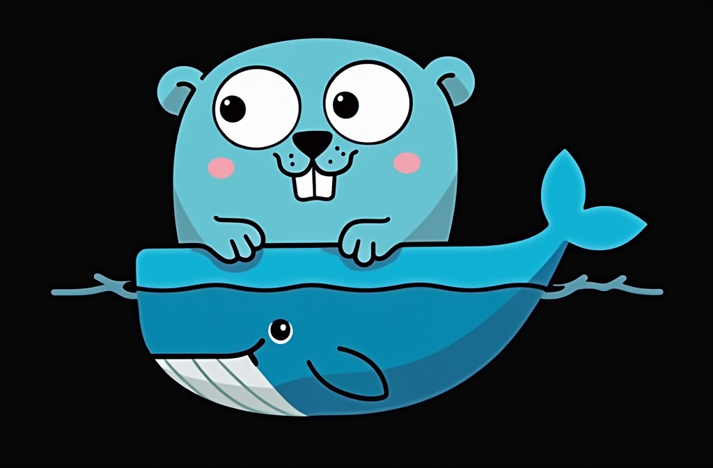
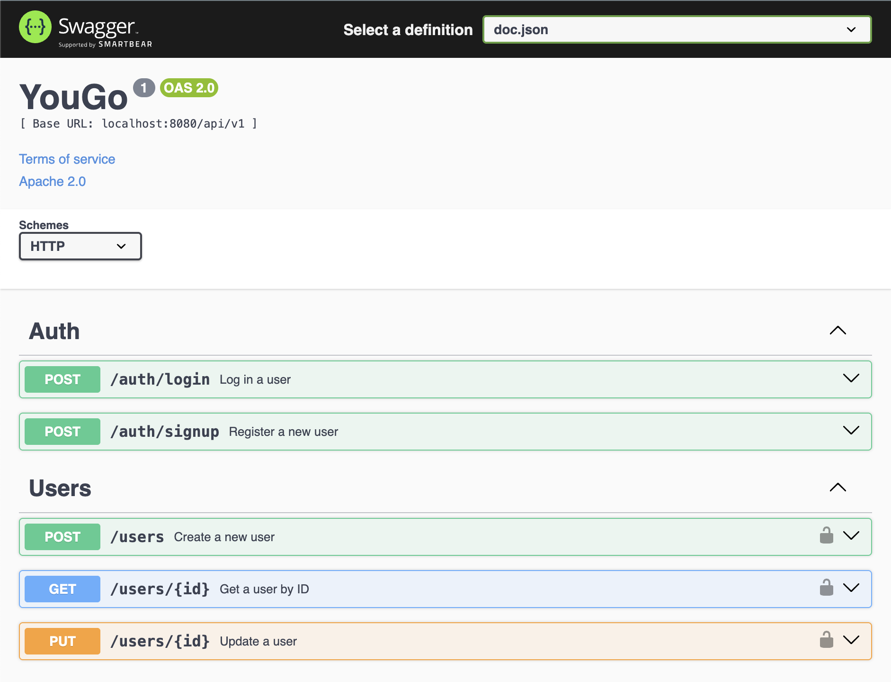

# YouGo: Golang API Skeleton

---



---

> Ready-to-use API starter project for building REST APIs with `Golang and Echo framework`. This project provides a
> foundation demonstrating a layered architecture and integration with common tools and technologies.

## 🔧 Technology Stack

|                        |                                                      |
|------------------------|------------------------------------------------------|
| **Framework**          | Go v1.24+ with Echo v4                               |
| **Database**           | PostgreSQL <br/> (using `jackc/pgx` driver via GORM) |
| **Containerization**   | Docker & Docker Compose                              |
| **Configuration**      | `.env`                                               |
| **ORM:**               | GORM (`gorm.io/gorm`)                                |
| **Authentication:**    | JWT                                                  |
| **Migrations:**        | `golang-migrate/migrate`                             |
| **Example Handlers:**  | CRUD operations for Users and Auth endpoints         |
| **API Documentation:** | Swagger via `swaggo/swag` annotations                |

---

## 🚧 Initial Project Setup (Common Steps)

Needed regardless of whether you use Docker or not.

1. **Clone the repository:**

```bash
    git clone https://github.com/raph-abdul/youGo
    cd youGo
```

2. **Configure Environment File:**

```bash
   cp .env.example .env
```

3. **Install Go Dependencies:**

```bash
    go mod tidy
```

---

# 🐳 Workflow with Docker (Recommended)

## 1. Requirements:

* **Go:** Version 1.24 or higher (Used by Docker build process) ([Download Go](https://golang.org/dl/))

* **Docker & Docker Compose:** ([Install Docker](https://docs.docker.com/get-docker/)).

### Optional (useful during development):

* **`swag`:** Needed to modify API annotations and generate documentation. Install via:

```bash
   go install github.com/swaggo/swag/cmd/swag@latest
```

* **`golang-migrate/migrate`**: Used to create migration files. Install via:

```bash
   go install -tags 'postgres' github.com/golang-migrate/migrate/v4/cmd/migrate@latest
```

*(Note: `migrate` tool is included in the Docker image).*

## 2. Running the Application with Docker

1. **Build Docker Images**

```bash
   docker-compose build
```

2. **Start Services**

```bash
   docker-compose up -d
```

3. **Run Database Migrations inside running container**

```bash
   docker-compose exec app ./scripts/migrate.sh up
```

4. **Access Application**

- API: `http://localhost:8080`
- Swagger UI: `http://localhost:8080/swagger/index.html`



## 3. Development Workflow with Docker

To apply changes to your .go files in a Dockerized application, you'll generally need to rebuild your Docker image and
restart the container.

- Changes in API annotations require `swag init` to regenerate files in `docs/`:

```bash
   swag init -g cmd/api/main.go -o docs --parseDependency --parseInternal
```

- New database migrations require `migration create`:

```bash
   migrate create -ext sql -dir migrations -seq <migration_name>
```

### Rebuild the Application

This command rebuilds the Docker image, stops and removes all running containers and restarts the updated container:

```bash
    docker-compose build app &&
    docker-compose down &&
    docker-compose up -d
```

* **If new migrations were added**, apply them to the containerized DB:

```bash
    docker-compose exec app ./scripts/migrate.sh up
```

* **Test** changes by accessing the API or viewing the Swagger UI.

---

# 🏗️ Workflow without Docker (Alternative)

This requires managing the database and dependencies directly on your host machine.

## 1. Requirements:

* **Go:** Version 1.24 or higher ([Download Go](https://golang.org/dl/))

* **PostgreSQL**: A locally running or accessible instance.

## 2. Running the Application

1. **Database Setup:**

- Ensure your PostgreSQL server is running.
- Ensure DB variables in `.env` point correctly to this local database.
- Make the migration script executable:`chmod +x scripts/migrate.sh`
- Run database migrations:

```bash
   ./scripts/migrate.sh up
```

2. **Run the Application:**

```bash
   ./scripts/run.sh
   # Or directly: go run ./cmd/api/main.go
```

3. **Access Application**:

- API: `http://localhost:8080` (or configured port)
- Swagger UI: `http://localhost:8080/swagger/index.html`

## 3. Development Workflow Locally

1. Make changes to Go code.

2. If API annotations were changed, run `swag init ...` locally.

3. If new database migrations were added:
    * Run `migrate create ...` locally.
    * Edit the SQL files.
    * Apply migrations:`./scripts/migrate.sh up`
4. Stop the previous run (if any) and restart the application:
   `go run ./cmd/api/main.go` or `./scripts/run.sh`
5. Test changes

---

## 📄 License

This project is licensed under the Apache License 2.0 - see the [LICENSE](LICENSE) file for details.


---

### Greetings from Bali,

### \- Raph Abdul 🍀✨

